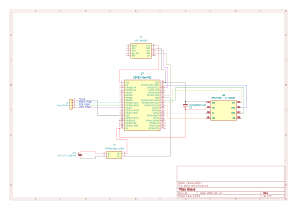
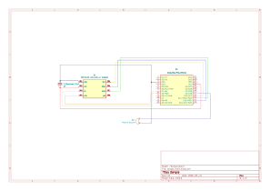

# Hardware

The system has two devices - a wearable **glove** and a USB **dongle** - that
communicate over a 2.4 GHz nRF24L01 radio link.

## Bill of materials

### Glove

| Component       | Part                                                          | Role |
|-----------------|---------------------------------------------------------------|------|
| Microcontroller | ESP32 Dev Module                                              | Glove controller |
| IMU             | DFRobot BNO055 - Fermion 9-axis (SEN0374)                     | Hand-orientation sensing (3.3 V) |
| Radio           | Optum nRF24L01+ 2.4 GHz transceiver                           | Wireless link to the dongle |
| Radio adapter   | Haitronic 8-pin socket adapter for wireless transceiver       | Accepts 5 V, supplies a regulated 3.3 V to the nRF24 |
| Decoupling      | 47 µF capacitor                                               | Across the nRF24 VCC/GND for supply stability |
| Battery         | 3.7 V 1200 mAh LiPo (4.4 Wh)                                  | Untethered power |
| Power board     | DC-DC boost converter, 3.7 V -> 5 V 2 A, USB-C charge/discharge | Battery charging + regulated 5 V rail |

### Dongle

| Component       | Part                                                      | Role |
|-----------------|-----------------------------------------------------------|------|
| Microcontroller | Haitronic Leonardo Pro Micro (ATmega32U4 5 V / 16 MHz)   | Dongle controller - Native USB HID |
| Radio           | nRF24L01+ PA/LNA with SMA antenna                         | Wireless link to the glove (extended range) |
| Radio adapter   | Haitronic 8-pin socket adapter for wireless transceiver   | Accepts 5 V, supplies a regulated 3.3 V to the nRF24 |
| Decoupling      | 47 µF capacitor                                           | Across the nRF24 VCC/GND for supply stability |
| Host link       | USB cable to PC                                           | Power and HID data |

## Schematics

### Glove

PDF source: [`schematics/glove.pdf`](schematics/glove.pdf)

### Dongle

PDF source: [`schematics/dongle.pdf`](schematics/dongle.pdf)
